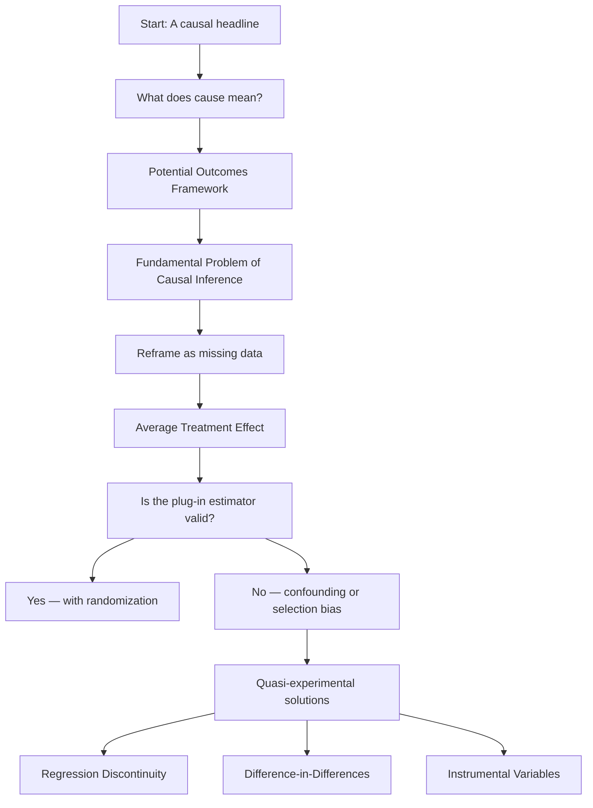
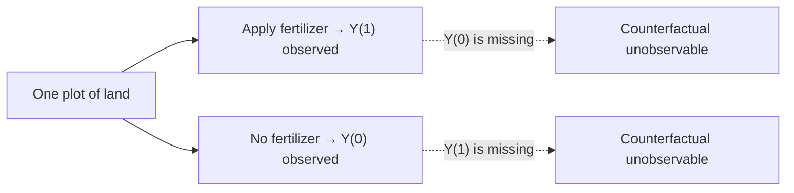

In this tutorial, Carolina Torreblanca — Penn AI Fellow in the Department of Political Science at Penn — walks through the logic of causal inference from first principles. Starting with a real newspaper headline, she builds up the Potential Outcomes Framework step by step and shows why isolating cause from correlation is genuinely hard — and how modern social science has developed principled tools to get there. No statistics background required; familiarity with the idea of correlation is sufficient.

## What You'll Learn

- Why the intuitive reading of causal claims in research headlines is usually wrong
- How the Potential Outcomes Framework defines causation rigorously
- Why individual causal effects are unobservable — and how to reframe that as a missing data problem
- What the Average Treatment Effect is and when the simple group-comparison estimator is valid
- Why randomization solves the identification problem so powerfully
- What confounding and selection bias look like in practice, with concrete examples
- Which quasi-experimental strategies are available when randomization is off the table



## The Causal Question Behind Every Headline

Carolina opened with a headline from the Medical Journal of Australia: *"High social media use increases mental health risk in adolescents."* The paper followed 1,200 teenagers over a decade and found that those using social media more than two hours a day faced a higher risk of depression than lighter users.

The headline sounds decisive. But does this study establish that social media *causes* depression? This tension — between observing a correlation and claiming causation — is the central problem of empirical social science, and the starting point for the entire tutorial.

## What "Cause" Means in Social Science

Causality means different things across disciplines. Carolina outlined three frameworks to locate where social science sits:

- **Necessary condition** (hard sciences): oxygen is necessary for combustion — without it, no fire. Social media is not a necessary cause of depression; many heavy users are completely fine.
- **Sufficient condition** (hard sciences): exceeding 100°C is sufficient for water to boil. Social media use is not sufficient for depression either — plenty of heavy users never become depressed.
- **Probabilistic statement** (social sciences): social media use *makes depression more likely*. This is an inherent comparison: heavy users are more likely to develop depression than... whom?

That final question — *compared to what?* — is the engine of causal inference in the social sciences.

## The Potential Outcomes Framework

To answer "compared to what?" rigorously, Carolina introduced the **Potential Outcomes Framework**, developed by Neyman in the 1920s and formalized by Rubin in the 1970s. Neyman's original application was, fittingly, fertilizer use.

The core idea: for any unit — a plot of land, a person, a country — imagine **two potential outcomes**:

- **Y(1)**: the yield if fertilizer *is* applied
- **Y(0)**: the yield if fertilizer is *not* applied

The causal effect of fertilizer on a single plot is the difference between these two potential outcomes:

```
τᵢ = Y(1)ᵢ − Y(0)ᵢ
```

Simple to define. Impossible to observe. That gap is the whole problem.

## The Fundamental Problem of Causal Inference

When the farmer applies fertilizer, they observe Y(1). When they don't, they observe Y(0). **They can never observe both outcomes for the same plot at the same time.** This is Holland's Fundamental Problem of Causal Inference: only one side of the counterfactual comparison is ever observable.

Carolina reframed this as a **missing data problem**. Picture a table: rows are plots of land, columns are Y(1) and Y(0). For each row, exactly one cell is filled in — whichever treatment was actually chosen. Computing τᵢ requires both cells; individual causal effects can never be recovered.



## From Individual Effects to the Average Treatment Effect

The move that makes progress possible: instead of individual causal effects, target the **Average Treatment Effect (ATE)** — the average of τᵢ across all units in the population.

By linearity of expectations, the ATE equals the difference of two population-level averages:

```
ATE = E[Y(1)] − E[Y(0)]
```

These are still averages over unobserved potential outcomes. But now a tempting shortcut appears: compute the average outcome among treated units (Ȳ₁) and the average among untreated units (Ȳ₀), and use their difference as the estimate.

Whether this is valid comes down to one critical question.

## The Identification Question: Are the Groups Comparable?

The plug-in estimator Ȳ₁ − Ȳ₀ is a valid estimate of the ATE only if the treated and untreated groups are **identical in expectation** on everything that matters — that is, if treated units would have had the same average outcome as untreated units, had they not been treated.

This is a counterfactual claim. It can never be directly verified. The entire practice of causal inference is about making this claim as **plausible** as possible.

## Randomization: The Gold Standard

The most compelling way to satisfy that requirement is **randomization**. If treatment assignment is determined by a coin flip, the Central Limit Theorem guarantees that the two groups will be identical in expectation on every pre-treatment characteristic — observed *and* unobserved.

Back to the farmer: flip a coin to decide which plots get fertilizer. The treated and untreated plots will, on average, be equally sunny, equally sloped, equally everything. Randomization doesn't guarantee identical groups in any single experiment, but it produces them *in expectation* — and that's enough to justify the plug-in estimator as an unbiased estimate of the ATE.

This is why randomized controlled trials are the gold standard in medicine, economics, and policy evaluation.

## When Randomization Isn't Possible

Many of the most important causal questions in social science cannot be randomized — for ethical, logistical, or political reasons:

- Does victimization increase political participation? (Can't randomly victimize people)
- Do wars strengthen national identity? (Can't randomize wars)
- Does immigration lower native wages? (Steep ethical concerns, potential harm to immigrants)

Carolina flagged a real debate here: some researchers argue it's better to have a *narrow but credible* causal answer than to make vague causal claims about big questions. Her own view is more pluralistic — don't abandon either rigor or ambition, but be honest about what your design can actually establish.

## Confounding and Selection Bias

When randomization isn't available, two threats undermine the plug-in estimator:

### Confounding

A **confounder** is a third variable that causes both the treatment and the outcome, producing a spurious association between them.

- **Wine and longevity**: wine drinkers show a 21% lower risk of cardiovascular death than beer or spirit drinkers. But wine is expensive — class shapes both the decision to drink wine *and* health outcomes. The apparent benefit of wine is confounded by socioeconomic status.
- **Museums and longevity**: British researchers found museum visitors less likely to die during the study period. But museum visits require time and money — the relationship is confounded by income and education.

### Selection Bias

**Selection bias** occurs when the sample is conditioned on a variable that is itself affected by the treatment, distorting the observed relationship.

Carolina's example: in NBA data, taller players score *fewer* points on average. This seems to contradict everything we know about basketball. But NBA players are not a random sample of people — short players only make the NBA if they compensate with extraordinary skill. Conditioning on "made the NBA" selects a distribution where the usual height–performance relationship is inverted.

## Quasi-Experimental Methods

When randomization is off the table, researchers look for settings where nature or policy introduced *as-if* random variation in who received treatment. The main toolkit:

- **Lottery/Draft designs**: the 1969 Vietnam draft lottery assigned draft order by birthday — a genuinely random instrument. Researchers use lottery position to estimate the effect of military service on later earnings, sidestepping the problem that volunteers differ from non-volunteers in ways that affect earnings.
- **Regression Discontinuity (RDD)**: compares units just above and just below an arbitrary cutoff (a test score threshold, an age limit). Near the cutoff, assignment is essentially accidental — making the two groups valid counterfactuals for each other.
- **Difference-in-Differences (DiD)**: compares before/after changes in a treated group against before/after changes in an untreated control group, canceling out stable confounders.
- **Instrumental Variables (IV)**: finds a variable that affects treatment but has no direct path to the outcome — using it as a lever to isolate exogenous variation in the treatment.

Each method rests on a different set of assumptions to justify the core claim: that the comparison being drawn is a plausible stand-in for the unobservable counterfactual.

## Closing

The session returned to its opening headline: does social media *cause* depression in teenagers? Carolina's analysis of the study's design points to real concerns. Heavy and light users likely differ in unobserved ways — predisposition to depression, family environment, degree of social isolation — that also affect mental health. The comparison may be confounded, or even causally reversed: struggling teens may seek out more social media, not the other way around.

The lesson isn't that causal claims are impossible — it's that they require a defensible design. Causal inference is the art of making a specific counterfactual comparison *explicit* and *plausible*. Whether you're running a randomized trial, exploiting a policy discontinuity, or modeling the full data-generating process, the question is always the same: why should I believe that your comparison group is a valid stand-in for the world that didn't happen?

For researchers working with AI systems — evaluating model interventions, measuring the effect of prompting strategies, or interpreting observational patterns in model behavior — that question is just as central as it is in any social science study.